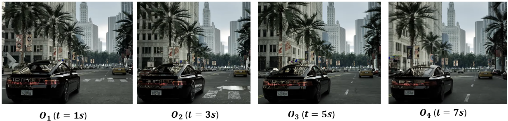
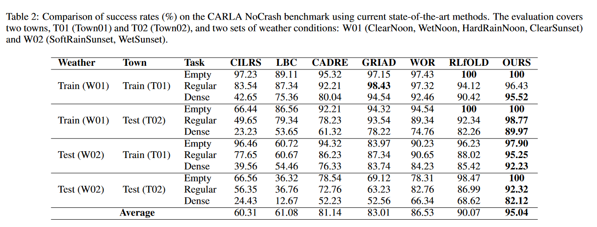
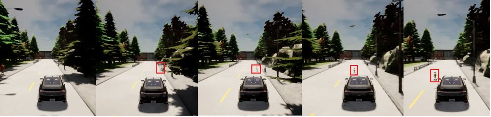
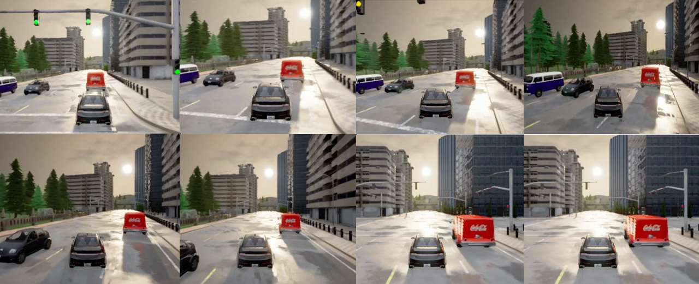
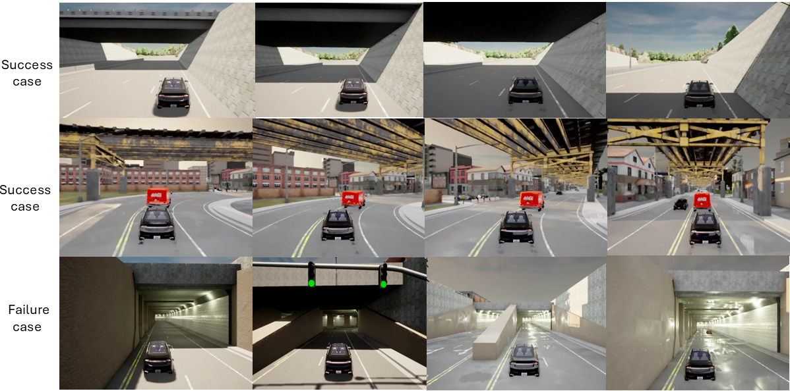
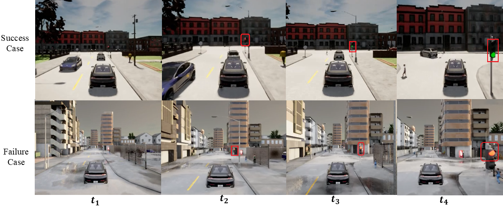

# Towards Generalized and Safer Urban Autonomous Navigation Using Diffusion-Guided Deep Reinforcement Learning

<p style="font-size: 14px; font-weight: normal; text-align: center;"> Sequential observations at different intervals show minimal changes in subsequent scenes and nearly identical actions between closely spaced frames. This indicates that minor variations in observations do not significantly influence vehicle behavior. Such stability is crucial, as it provides a robust foundation for developing a generalized solution capable of effectively addressing environmental uncertainties..</p>

# <h3 style="font-size: 16px; font-weight: normal;">Abstract</h3>
Vision-based motion planning is a crucial task in Autonomous Driving (AD). Recent advancements in urban AD show that integrating Imitation Learning (IL) with Deep Reinforcement Learning (DRL) improves decision-making to be more like humans. However, IL methods depend on expert demonstrations to learn the optimal policy. The main drawback of this approach is the assumption that expert demonstrations are always optimal, which isn’t always true in real-world settings. This creates challenges in adapting to diverse weather conditions (e.g., rain, mirage, and lightning) and dynamic traffic scenarios, often resulting in higher collision rates and increased risks to pedestrian safety. To address these challenges, we propose a Diffusion-Guided Deep Reinforcement Learning (DGDRL) framework that integrates a diffusion model with a Soft Actor-Critic DRL method to handle environmental uncertainties. This framework follows a novel modified partially observable Markov decision process (mPOMDP) to choose optimal action from original and diffusion-generated observations, ensuring that the policy behavior remains consistent with the current action. We utilize the CARLA NoCrash benchmark simulation platform to collect data and evaluate the proposed framework. The proposed method is trained on an NVIDIA L40S GPU and validated in simulated urban environments, which include scenarios with empty, regular, and dense traffic conditions across different town settings. Additionally, we have evaluated our model against several state-of-the-art techniques to ensure its robustness in generalizing to new environments.

## <h3 style="font-size: 16px; font-weight: normal;">CARLA Installtion</h3>
* Download and install [CARLA 0.9.10.1](https://github.com/carla-simulator/carla/releases/tag/0.9.10.1) release with additional maps.
```
Intall Ubuntu 20.04.6
mkdir -p /home/ubuntu/carla
cd /home/ubuntu/carla
tar -xvzf CARLA_0.9.11.tar.gz
echo "export CARLA_ROOT=/home/ubuntu/carla" >> /home/ubuntu/.bashrc
cd Import, Download AdditionalMaps file.
cd ../; bash ImportAssets.sh
source /home/ubuntu/.bashrc
cd /home/ubuntu/ & place DGDRL files in ubuntu dir.
unzip carla_env.zip file
Install all python3.8 packages as per requirements.txt file.
```

* Run DGDRL
```
Start the CARLA server
cd /home/ubuntu/carla & ./CarlaUE4.sh --port=2000
cd ../ 

Training Model:
#python main.py -en dgdrl -vm

Testing Model:
date; for i in $(ls  /<home-dir>/config/experiments/dgdrl/|grep -i test );do echo $i;python main.py -en dgdrl -vm -ttc $i -ow;done;date
```

## Test Scenarios
The table below lists the YAML configuration files used for testing various scenarios. 
Source dir: config/experiments/dgdrl

| **Dense Tests**                   | **Regular Tests**                  | **Empty Tests**                  |
|-----------------------------------|-------------------------------------|----------------------------------|
| test-dense_t03_wnew.yaml          | test-regular_t01_wtrain.yaml       | test-empty_t01_wnew.yaml        |
| test-dense_t04_wnew.yaml          | test-regular_t02_wnew.yaml         | test-empty_t01_wtrain.yaml      |
| test-dense_t05_wnew.yaml          | test-regular_t02_wtrain.yaml       | test-empty_t02_wnew.yaml        |
| test-dense_t01_wtrain.yaml        | test-regular_t03_wnew.yaml         | test-empty_t02_wtrain.yaml      |
| test-dense_t01_wnew.yaml          | test-regular_t04_wnew.yaml         | test-empty_t03_wnew.yaml        |
| test-dense_t02_wnew.yaml          | test-regular_t05_wnew.yaml         | test-empty_t03_wtrain.yaml      |
| test-dense_t02_wtrain.yaml        | test-regular_t03_wtrain.yaml       | test-empty_t04_wnew.yaml        |
| test-dense_t03_wtrain.yaml        | test-regular_t04_wtrain.yaml       | test-empty_t04_wtrain.yaml      |
| test-dense_t04_wtrain.yaml        | test-regular_t05_wtrain.yaml       | test-empty_t05_wnew.yaml        |

## Results

a) **Model Comparision**  



b) **Safety measures during unexpected events.**  



c) **Model’s ability to generalize beyond its training environment**  



d) **Exploring Unseen States: Success and Failures**  


e) **Handling traffic lights**  



# Credits
